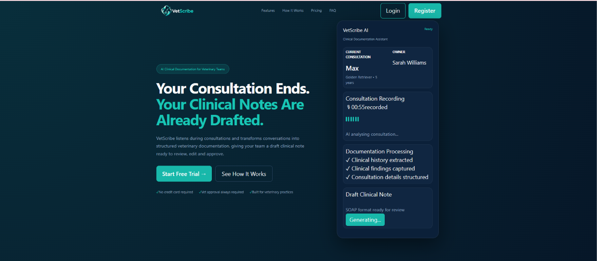
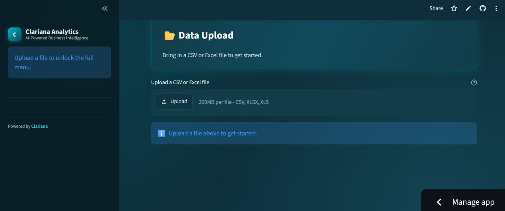
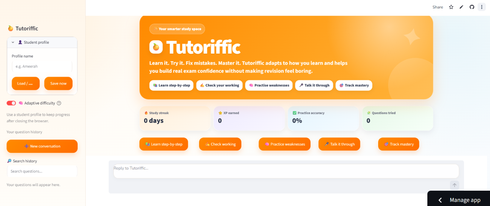

# 👋 Ameerah Diwan | AI & Automation Portfolio

### AI Automation | Workflow Automation | AI Products | Product Development

I design and build AI-powered products and automated workflows that solve real business and user problems.

My work focuses on identifying repetitive, fragmented or inefficient processes and exploring how AI and automation can make them simpler, faster and more useful — while keeping the user and business need at the centre of the solution.

---

# 🚀 Featured Projects

## 🎯 REACH — AI-Powered Market Development & Workflow Platform

**The problem:** Business development can involve repetitive research, switching between multiple tools, finding relevant organisations and contacts, preparing outreach and manually keeping track of opportunities.

**What I built:** REACH brings these activities together into a connected AI-powered market development workflow.

### What REACH Does

- Analyses a product or service to understand the potential market
- Identifies relevant customer segments
- Discovers organisations that may be relevant
- Supports AI-powered organisation research
- Helps identify relevant decision-makers and contact routes
- Generates personalised outreach
- Supports opportunity tracking and follow-up
- Stores market and prospect information within a structured workflow

**Workflow:**

`Understand → Discover → Research → Identify → Engage → Track`

**Tools:** AI · Workflow Automation · OpenAI API · REST APIs · Supabase/PostgreSQL · Companies House · Hunter · Python · Streamlit

🌐 [**Try REACH**](https://reach-ai-market-development.streamlit.app/)

🔗 [**View Project**](https://github.com/AmeerahD1/REACH-AI-Market-Development)

> The public portfolio version uses demonstration data and disables paid external API calls.

### 📸 REACH in Action

*Click the image to launch the REACH demo.*

---

## ⚡ Lead Generation Workflow Automation — In Development

**The problem:** Lead generation can involve repetitive searching, collecting information, organising lead data and moving information manually between different tools.

**What I'm building:** As part of my Clariana internship, I am currently developing an n8n-based workflow designed to automate repetitive stages of the lead-generation process.

### Workflow Areas

- Lead discovery and information gathering
- Automated workflow orchestration
- Data processing and enrichment
- API integrations
- Structured lead information
- AI-assisted processing
- Reducing repetitive manual work

**Tools:** n8n · APIs · JSON · AI Automation · Workflow Design

🚧 **Status: Currently in development**

> Company-confidential workflows, credentials and proprietary information are not included in this public portfolio.

---

## 🐾 VetScribe — AI Veterinary Workflow Platform

**The problem:** Veterinary administration extends before, during and after consultations, reducing the time veterinary teams can spend focusing on animals and their owners.

**My contribution:** I am co-developing VetScribe with Clariana as a wider veterinary workflow product rather than simply an AI note-generation tool.

### What I Worked On

- Helped develop **4 connected veterinary workflow stages**
- Tested the platform across **2 user roles**
- Identified **15+ functional and UX improvements**
- Reviewed consultation and patient workflows
- Tested permissions and practice-management processes
- Identified opportunities to make actions and next steps clearer for users
- Contributed to improving usability and suitability for real veterinary workflows

**Focus:** AI Product Development · Workflow Design · User Experience · Product Testing · Process Improvement

🌐 [**View VetScribe Live**](https://vetscribe.clariana.co.uk/)

> VetScribe is a commercial Clariana product. Proprietary source code is not included in this portfolio.

### 📸 VetScribe in Action

*Click the image to visit VetScribe.*

---

## 📊 Clariana Analytics — AI & Data Analytics Platform

**The problem:** Business data can be difficult for non-technical users to explore and understand without specialist analytical knowledge.

**My contribution:** Helped test and improve an AI-powered analytics platform designed to make organisational data and insights more accessible to non-technical users.

### Impact

- Tested datasets ranging from **510 to 541,000+ records**
- Worked across **11 functional areas**
- Helped identify and resolve **10+ AI, data, configuration and UX issues**
- Tested AI grounding, filtering, forecasting and visualisation
- Supported improvements to reliability and usability
- Contributed to testing analytical workflows and deployment

**Focus:** AI Products · Product Testing · Data Analytics · User Experience · Quality Assurance

🌐 [**View Clariana Analytics Live**](https://clariana-analytics-95j63uwbydwyojdyv8m8tq.streamlit.app/)

> Clariana Analytics is a commercial Clariana product. Proprietary company source code is not included in this portfolio.

### 📸 Clariana Analytics in Action

*Click the image to visit Clariana Analytics.*

---

## 🧠 RAG AI Assistant — Organisational Knowledge Workflow

**The problem:** Finding specific information across lengthy documents can be slow and repetitive.

**What I built:** A Retrieval-Augmented Generation (RAG) workflow that turns supplied documents into searchable knowledge and allows users to ask questions using natural language.

### How It Works

`Documents → Process → Retrieve Relevant Information → AI Response`

### Key Capabilities

- Document processing
- Information chunking
- Semantic search
- Vector-based retrieval
- Context-grounded AI responses
- Natural-language information access

**Tools:** RAG · LangChain · Chroma · Hugging Face · OpenAI API · Python

🔗 [**Explore My GitHub**](https://github.com/AmeerahD1)

---

## 🎓 Tutoriffic — Multimodal AI Learning Assistant

**The problem:** Students can struggle to access immediate and personalised help when they are stuck on difficult questions, while general AI chatbots do not always provide the structure of ongoing tutoring.

**What I built:** Tutoriffic is an AI learning assistant designed to provide personalised explanations, practice and revision support.

### What It Does

- Supports text, image and voice learning interactions
- Covers **4 learning categories**
- Provides **3 tutoring modes**
- Adapts question difficulty
- Identifies weaker learning areas
- Generates targeted practice
- Uses RAG to support relevant learning material
- Uses revision intervals of **3, 7, 14 and 30 days**
- Maintains learner progress

**Focus:** AI Products · Personalised Learning · Workflow Design · User Experience

**Tools:** OpenAI API · RAG · Streamlit · SQLite · Python

🌐 [**Try Tutoriffic**](https://tutoriffic-ai-learning-assistant.streamlit.app/)

🔗 [**View Project**](https://github.com/AmeerahD1/Tutoriffic-AI-Learning-Assistant)

> The public recruiter demo uses sample AI responses with paid external AI APIs disabled.

### 📸 Tutoriffic in Action

*Click the image to launch Tutoriffic.*

---

# 🔄 How I Approach Automation

I am particularly interested in using AI where it solves a genuine problem rather than adding AI simply because the technology is available.

My approach is:

**1. Identify the problem**  
Understand where users or businesses are losing time, repeating work or struggling with an existing process.

**2. Understand the workflow**  
Look at how the process currently works and identify where the biggest friction exists.

**3. Identify what should be automated**  
Separate tasks that benefit from automation from those where human judgement remains important.

**4. Build the workflow**  
Connect AI, automation tools, APIs, data and existing systems where appropriate.

**5. Test with the user in mind**  
Check whether the solution actually makes the process easier, more reliable and more useful.

**6. Improve**  
Use testing and feedback to refine the product or workflow.

---

# 🛠️ Automation & Product Toolkit

**Automation & Workflows:**  
n8n · Workflow Automation · REST APIs · JSON · API Integration

**AI:**  
Generative AI · OpenAI API · RAG · LangChain · Chroma · Hugging Face

**Product:**  
Product Thinking · User Needs · Workflow Design · Product Testing · Problem Solving · Process Improvement

**Data & Analytics:**  
Python · SQL · Pandas · Excel · Power BI · Tableau

**Applications & Data:**  
Streamlit · Supabase · PostgreSQL · SQLite

**Supporting Tools:**  
Git · GitHub · VS Code · Jupyter

---

# 💡 What I Focus On

I'm particularly interested in opportunities involving:

- AI and workflow automation
- Low-code and no-code automation
- AI-powered products
- Business process improvement
- Product development
- AI implementation
- Connecting AI with existing business workflows
- Turning repetitive processes into connected automated workflows

I enjoy working at the intersection of **business problems, users and technology** — understanding what needs improving first, then deciding how AI or automation can help.

---

# 🎓 About Me

I am a **BSc Mathematics with Data Science graduate** with practical experience across AI automation, workflow development, AI products, data and product testing.

I enjoy taking a problem through:

**Problem → User Need → Workflow → Solution → Testing → Improvement**

My focus is not simply on building technology, but on making sure what is built has a clear purpose and improves the experience or process it was designed for.

---

# 🔗 Explore My Work

🌐 **Portfolio:** [ameerahd1.github.io](https://ameerahd1.github.io)

💻 **GitHub:** [github.com/AmeerahD1](https://github.com/AmeerahD1)

🎯 **REACH:** [Launch REACH](https://reach-ai-market-development.streamlit.app/)

🐾 **VetScribe:** [Visit VetScribe](https://vetscribe.clariana.co.uk/)

📊 **Clariana Analytics:** [Launch Clariana Analytics](https://clariana-analytics-95j63uwbydwyojdyv8m8tq.streamlit.app/)

🎓 **Tutoriffic:** [Launch Tutoriffic](https://tutoriffic-ai-learning-assistant.streamlit.app/)

---

*More AI and automation workflows are currently in development.*
